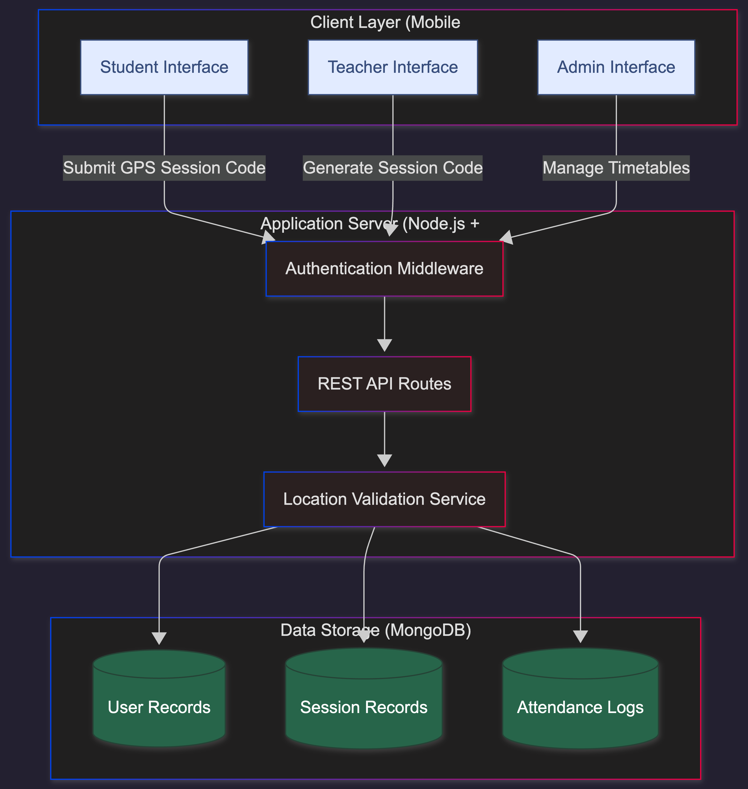
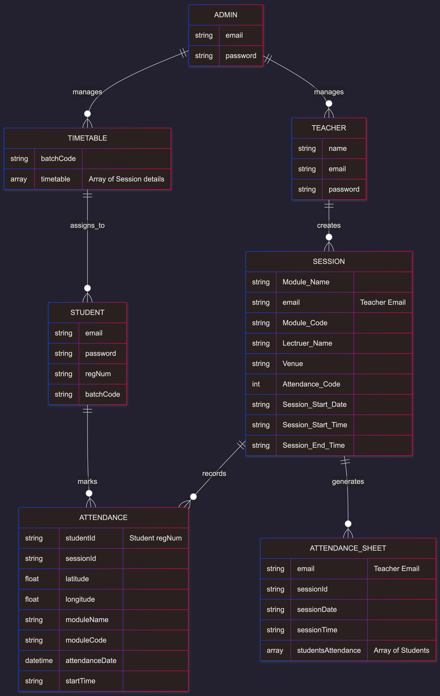
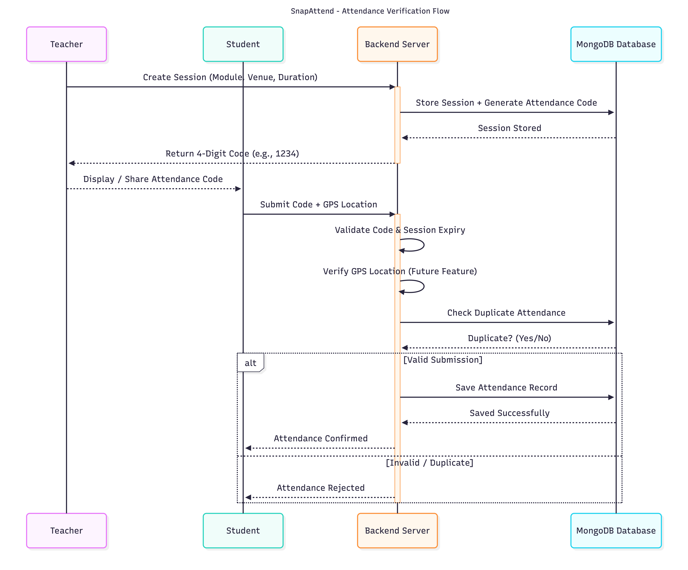

# 📍 SnapAttend: Smart Location-Based Attendance System

[](https://expo.dev/)
[](https://reactnative.dev/)
[](https://nodejs.org/)
[](https://www.mongodb.com/)
[](https://expressjs.com/)

SnapAttend is a modern, full-stack attendance management solution designed for educational institutions. It leverages **GPS location verification** and **OTP/Code synchronization** to ensure that students are physically present in the lecture hall when marking their attendance.

---

##  System Architecture

The following diagram illustrates the high-level interaction between the Mobile Application, Backend Server, and MongoDB Database.

<p align="center">
  
</p>

---

##  Database Schema (ER Diagram)

This diagram represents the relationships between the core data models used in SnapAttend.

<p align="center">
  
</p>

---

##  Core Workflow: Attendance Process

This workflow illustrates how attendance is securely verified using session codes and GPS validation.

<p align="center">
  
</p>

---

## Features

### 👨‍🎓 For Students

* **Real-time Check-in**: Secure attendance marking using session-specific codes.
* **Location Verification**: Mapping student location to ensure physical presence.
* **Timetable Access**: Personalized schedules based on batch codes.
* **Attendance History**: Tracking past attendance trends.

### 👩‍🏫 For Teachers

* **Instant Session Creation**: Quick forms to generate attendance OTPs.
* **Live Monitoring**: View student submissions on a real-time Map View.
* **Attendance Reports**: Export and view consolidated attendance sheets.
* **Session Control**: Manual override and code expiration timers.

### 🔑 For Admins

* **User Management**: Direct registration of Students and Lecturers.
* **Master Timetable**: Creation and management of recurring lecture schedules.
* **System Audits**: Monitoring all activities across the platform.

---

## Tech Stack

* **Frontend**: React Native (Expo SDK), React Navigation
* **Maps API**: React Native Maps
* **State Management**: React Context API
* **Backend**: Node.js, Express.js
* **Database**: MongoDB (Mongoose)
* **Authentication**: JSON Web Tokens (JWT) & Bcrypt

---

## ⚠️ Important Setup Notes

### 1. Localhost Connection Issue

> **On Physical Devices (Expo Go)**: `localhost` **will fail.** Use your computer's **Local IP Address** instead.

* Update `baseURL` in `src/api/tracker.js` to `http://<YOUR_IP>:3000`.
* Ensure both computer and device are on the **same Wi-Fi network**.

### 2. Environment Variables

* Backend (`track-server`) requires `.env` with:

```env
MONGODB_URI=your_mongodb_connection_string
JWT_SECRET=your_secured_secret_word
```

### 3. Clearing Bundler Cache

```bash
npx expo start --clear
```

### 4. Dependency Version Mismatches

```bash
npx expo doctor
npx expo install --fix
```

### 5. Entry Point (`package.json`)

```json
"main": "node_modules/expo/AppEntry.js"
```

### 6. macOS 'Too Many Open Files'

* Adjust `metro.config.js` to block redundant loops if necessary.

---

## Installation

### Prerequisites

* Node.js (v16+)
* Expo CLI
* MongoDB Instance

### Server Setup

```bash
cd track-server
npm install
# Create .env with MONGODB_URI and JWT_SECRET
npm start
```

### App Setup

```bash
cd track
npm install
# Ensure baseURL in src/api/tracker.js matches server IP
npx expo start
```

---

## 📌 Key Learning Outcomes

This project demonstrates practical implementation of:

* Full-stack mobile application architecture
* Secure attendance verification using OTP and location validation
* REST API design with Node.js and Express
* MongoDB schema modeling using Mongoose
* JWT authentication and role-based access control
* Mobile UI development using React Native and Expo

---

## License

This project is licensed under the MIT License - see the [LICENSE](LICENSE) file for details.

---

*Created with ❤️ for Smart Education Management.*
